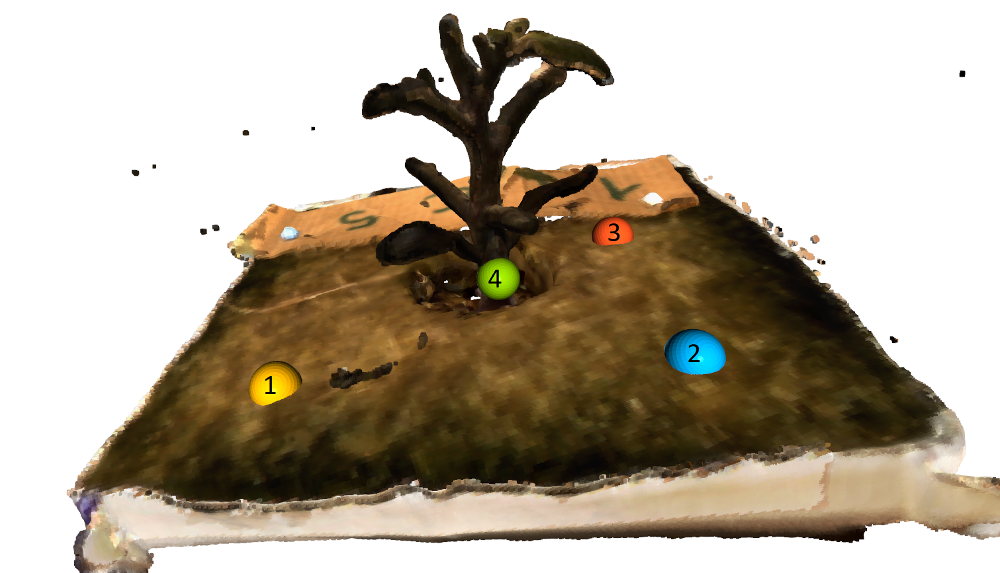

# Pointcloud tranformation for the stand alone turntable
This program opens the pointcloud in the `/pointclouds` folder one by one in the interactive 3D vieuwer of open3D.
It allows the user to select a point, close the viewer and than move the origin of the pointcloud to the selected point.
The order in which the points are marked influences the rotation and move operation. 
It is recommended to select the points in the order shown in the image below:
- The first three are used to create two vectors. One from Point 0 to 1 and one from point 2 to 1. 
These vectors are aligned with the X and Z axes, wnsuring the pointcloud is oriented as flas as posible in the Y direction.
- Point 4 is used as new origin of the pointclouds, giving a solid zero points for further analysis.



## Open3d interactive viewer
The left mouse button and moving the mouse rotates the pointcloud and the mouse wheel can be used to zoom. 
Points can be selected by pressing `shift + left click`.
To undo the selection use: `shift + right click`.
After selecting, `q` can be used to close the viewer.
For more information see: http://www.open3d.org/docs/release/tutorial/visualization/interactive_visualization.html

## Getting started
Open a commandline in this folder and run the following commands to create a virtual environment and install the requirements.
```
python -m venv venv
venv/scripts/activate
python -m pip install -R requirements
```
